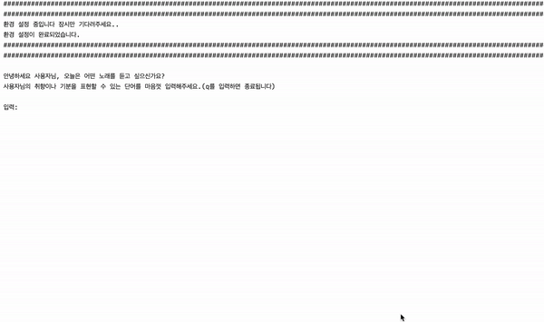

# 플레이리스트 기반 곡 추천 시스템

By: 4기 김동욱, 5기 조신형, 6기 황다연, 6기 김서현

### <DSL 21-2 심화 스터디 프로젝트>

[카카오 아레나](https://arena.kakao.com/c/7)에서 제공하는 멜론 플레이리스트 데이터를 기반으로, 유저에게 입력 받은 단어를 기반으로 곡을 추천하는 알고리즘 입니다.

협업 필터링을 이용한 추천시스템의 기본적인 설명과 해당 알고리즘의 구체적인 구현 방식은 ppt를 참고해주세요!

- `helper.py` 파일을 통해 추천시스템을 실행할 수 있습니다.
- `song_meta.json` 데이터는 카카오 아레나를 통해 다운받을 수 있습니다.

---

#### 모델 실행 예시

